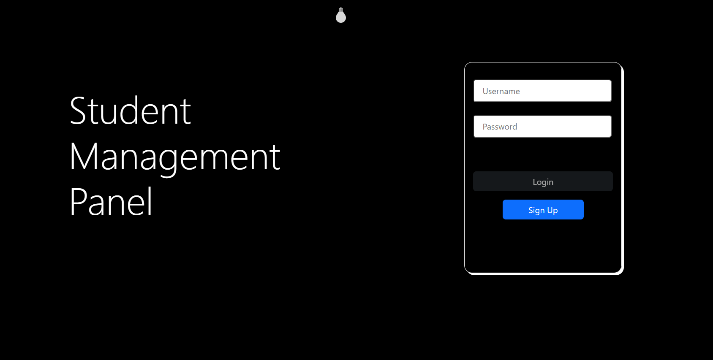
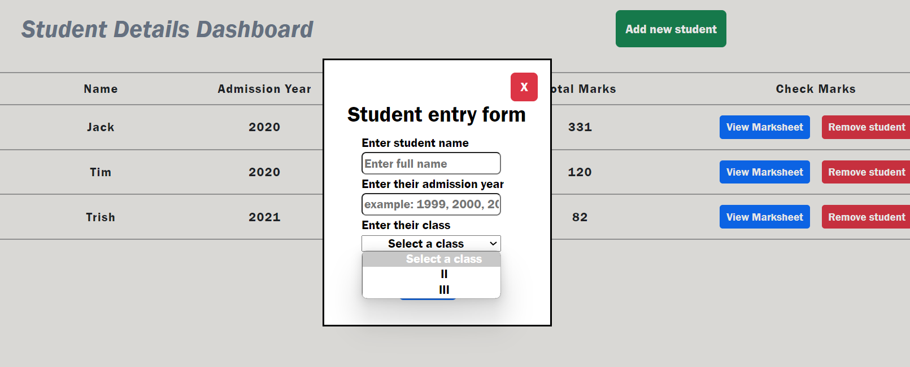

# Student Management Panel

- Stack used:
  - Flask: for implementing CRUD based APIs
  - MySQL: for database and tables
  - Marshmallow: for creating schemas
  - Peewee: for creating models of tables
  - HTML/CSS: for creating static pages
  - JavaScript: for receiving AJAX/Jquery response/requests

## Dark mode implementation:

## Light Mode implementation:

## Homepage after login:

## Subjects Dashboard implementation:

### New subject entry popup

### Update subject popup

## Classes Dashboard implementation:

### Class Entry popup:

### Class update popup:

## Students Dashboard implementation:

### New Student entry popup:

### View Student marksheet popup:

